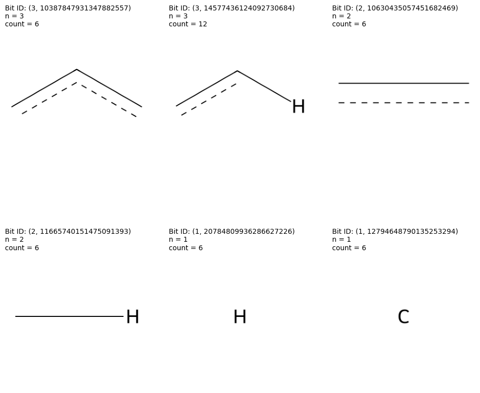
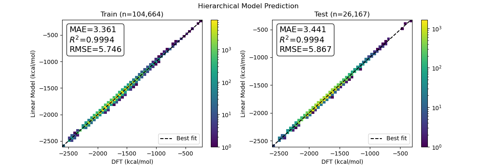
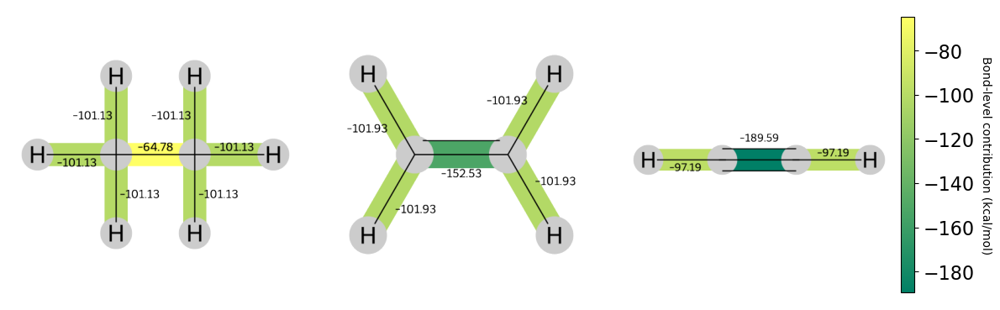

# MinervaChem - a python library for cheminformatics and machine learning.

Minervachem implements Graphlet Fingerprints and other utilities cheminformatics and chemical machine learning.

This is an alpha release, so be prepared for breaking changes --
keep track of what version you are using if you need to maintain consistency.

## Installation

There are currently two ways to get `minervachem` up and running: 
1. Build from conda `env.yml` and this git repo
2. NOT RECOMMENDED install this repo and dependencies via `pip`

### Conda installation

Steps: 
1. Clone this repo and `cd` into it
2. 
    a. If creating a new conda environment: `conda env create -n minervachem --file env.yml`
    b. If installing into an existing conda environment: `conda env update -n <YOUR_ENV_NAME> -f env.yml`
3. `pip install -e .`

### Pip Installation 

**This is not recommended**  

Steps: 
1. Clone this repo and `cd` into it.
2. install the package with `pip install -e .`
3. If running demos, install your preferred variant of jupyter

### For Developers
You'll also want to run `pip install -r requirements_developer.txt`

# Getting started with `minervachem`

We recommend looking through and running the notebooks in the `demos/` directory for a detailed introduction to `minervachem`'s funcitonality.

## Citing Minervachem

Besides this code repository, please see and cite [this preprint](https://doi.org/10.26434/chemrxiv-2024-r81c8):

    Linear Graphlet Models for Accurate and Interpretable Cheminformatics
    Michael Tynes, Michael G Taylor, Jan Janssen, Daniel J. Burrill, Danny Perez, Ping Yang, Nicholas Lubbers
    ChemRxiv preprint, 2024
    https://doi.org/10.26434/chemrxiv-2024-r81c8

## Highlights

### Constructing graphlet fingerprints

`Fingerprinter` classes provide reusable objects for generating molecular fingerprints, including the graphlet fingerprints described in our manuscript.

```python
from rdkit.Chem import MolFromSmiles, AddHs
from minervachem.fingerprinters import GraphletFingerprinter

# Benzene
mol = AddHs(MolFromSmiles('c1ccccc1'))

# Reusable Fingerprinter object 
fingerprinter = GraphletFingerprinter(max_len=3)

# Fingerprints are a map from fragment IDs to fragment counts.
# The fragments are identified by their number of atoms and a hash.
fp, bi = fingerprinter(mol)
print(fp)
>>> {(3, 10387847931347882557): 6,
>>>  (2, 10630435057451682469): 6,
>>>  (2, 11665740151475091393): 6,
>>>  (3, 14577436124092730684): 12,
>>>  (1, 20784809936286627226): 6,
>>>  (1, 12794648790135253294): 6}

# We can visualize the above dictiory with a plotting method
from minervachem.plotting import plot_fingerprint
plot_fingerprint(mol, fingerprinter)
```


### scikit-learn transformers

We can quickly construct feature matrices for machine learning from a set of molecules using `minervachem`'s provided `sklearn`-style transformers:

```python
from minervachem.transformers import FingerprintFeaturizer

mols = [MolFromSmiles(s) for s in [
    'c1ccccc1',
    'NCNOCOC',
    'CN1C=NC2=C1C(=O)N(C(=O)N2C)C',
    'CNO',
]]

featurizer = FingerprintFeaturizer(
    fingerprinter, 
    n_jobs=2 # parallelism for large datasets
)

# FingerprintFeaturizer implements the sklearn transformer API
feature_matrix = featurizer.fit_transform(mols)
# which generates sparse integer matrices by default
feature_matrix
```
```
>>> <4x39 sparse matrix of type '<class 'numpy.int64'>'
	with 44 stored elements in Compressed Sparse Row format>
```

### Building Interpretable Machine Learning Models
#### Model fitting

After constructing a dataset through the methods above, we can use `minervachem` to fit an interpretable ML model. 

The below is a snippet from the demo notebook which fits a hierarchical linear model with ~6,000 coefficients to ~100,000 molecules from QM9. 

```python
import minervachem
from sklearn.linear_model import Ridge
from minervachem.regressors import HierarchicalResidualModel
from minervachem.plotting import parity_plot_train_test


# build a higherarchical residual model
# using a ridge regressor base model 
base_model = Ridge(fit_intercept=False, 
                   alpha=1e-5,
                   solver='sparse_cg')
hmodel = HierarchicalResidualModel(regressor=base_model,verbose=1)
hmodel.fit(X_train,y_train,levels=featurizer.bit_sizes_)

# visualize the train and test performance with 
# minervachem's plotting methods
parity_plot_train_test([X_train, X_test], 
                       [y_train, y_test],
                       hmodel, 
                       figsize=(12, 4),
                       xlab='DFT (kcal/mol)', 
                       ylab='Linear Model (kcal/mol)', 
                       title='Hierarchical Model Prediction');   
```



#### Model interpretations
Linear models are interpretable, but 6,000 coefficients is too many to look at all at once. (The most accurate models in our manuscript had >100,000 coefficients.) So, we use `minervachem`'s projection methods to visualize atom- or bond-level contributions to model predictions for a set of molecules. 

First we construct the Directed-Acyclic-Graph (DAG) between molecular graphlets that defines our projection operation:

```python
from minervachem.graphlet_dags import GraphletDAG, draw_projected_coefs

# Construct the DAG relating larger graphlets to smaller ones
# for each molecule
dags = []
for mol in mols:
    dag =  GraphletDAG(mol,
                       fingerprinter=featurizer.fingerprinter, # the fingerprinter that creates the graphlets
                       bit_ids=featurizer.bit_ids_, # The bit ids for the features used in the model training
                       coef=hmodel.coef_ # The model coefficients as an array.
                     )
    dags.append(dag)

draw_projected_coefs(dags,
                     level=2, # bond-level interpretations (atom-level is 1)
                    )
```



## Copyright and licensing

`minervachem` is released under the BSD-3 License. See LICENSE.txt for the full license.


The copyright to `minervachem` is owned by Triad National Security, LLC
and is released for open source use as project number O04631.


© 2023. Triad National Security, LLC. All rights reserved.
This program was produced under U.S. Government contract 89233218CNA000001 for Los Alamos
National Laboratory (LANL), which is operated by Triad National Security, LLC for the U.S.
Department of Energy/National Nuclear Security Administration. All rights in the program are.
reserved by Triad National Security, LLC, and the U.S. Department of Energy/National Nuclear
Security Administration. The Government is granted for itself and others acting on its behalf a
nonexclusive, paid-up, irrevocable worldwide license in this material to reproduce, prepare.
derivative works, distribute copies to the public, perform publicly and display publicly, and to permit.
others to do so.
